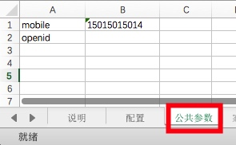

# 接口测试用例编写规范

接口测试用例文档（Excel 版本），可用于手工测试接口和自动化测试接口，所以规范比较重要。
一般一个接口测试用例文档主要包含四大部分：`说明、配置、公共参数、接口测试数据`，其中`配置、公共参数、接口测试数据`是必须要有的模块，`说明`选要。

## 1. 说明
简要说明这个接口测试用例包含的一些信息，修改记录等等。。。

## 2. 配置
主要用于自动化测试和统计当前文档的接口数目。主要包含的信息：接口协议、接口域名、接口配置列表。

- 接口协议：测试接口的网络协议，如：http、https，其他协议，等待以后版本支持。
- 接口域名：测试接口的域名。
- 接口配置参数：主要包括测试 ID、接口名称、运行模式、测试结果。

具体模板显示如下：


## 3. 公共参数
此表用于存储测试前设定好的参数和测试过程中提取出来的参数，以 `key,value` 的形式存储。sheet 名规定是`公共参数`，不可变化。如图所示



## 4. 接口测试数据
每个接口的测试数据占用一个 sheet 表。数据包括几个部分：sheet 名、接口路径、接口说明、接口参数组合，其中接口参数组合又细分为：接口调用方法、接口参数、测试预期结果、测试实际结果、提取公共参数。完整的例子如图所示：


### 4.1 sheet 名
一般使用接口名称，与 **配置表 - 接口配置参数-接口名称** 相对应。

### 4.2 接口路径
接口路径，是接口测试 url 中域名后面，参数前面的部分，如：

```
the/path/of/interface  # 接口测试路径样式
```

### 4.3 接口说明
对于接口用途的一个简要说明。

### 4.4 接口参数组合

1. 调用方法。一般为 http 协议的调用方法，如：`GET、POST` 等

2. 参数列表。接口的所有参数，必填和非必填。测试时，非必填参数可为空；异常情况测试，必填参数也可以为空。每个接口所要求的参数数目不一样，编写测试用例时，每个参数占用一列即可。参数列表可支持获取公共参数形式填写（`${ziduan}`），如：mobile 这个字段想从公共参数列表获取，则可以写成`${mobile}`。

3. 接口 url。由 **协议 + 域名 + 路径 + 参数** 拼接而成的完整 url，这个数据是在测试过程中自动生成的，也可以当做对测试结果的校验。

4. 预期结果：这个数据一般从接口文档的预期结果获取的，可支持正则表达式，匹配部分测试结果。可填入字段校验：`accesstoken`，也可以填写正则表达式校验`"accesstoken":"[a-zA-Z0-9]*"`。

5. 实际测试结果。在测试过程中，按照本次调用参数调用接口所产生的响应数据。

6. 是否通过测试。通过预期结果和实际测试结果的比对，得出接口当次测试是否通过。

7. 提取公共参数的名称，以`,`号区分开。如：提取两个公共参数`openid`和`accesstoken`，则可以填入`openid,accesstoken`即可。


